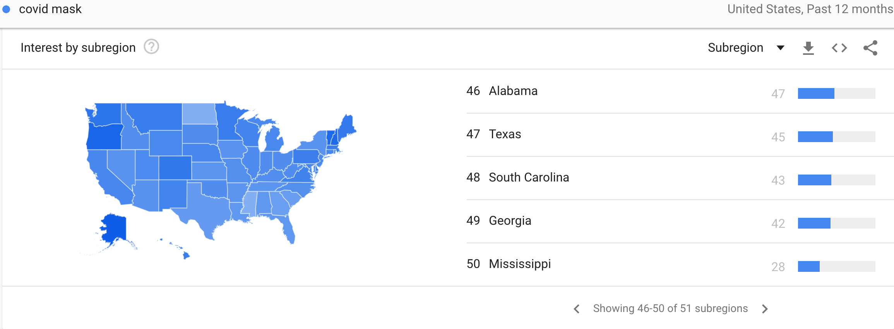

```{r, include = FALSE}
library(knitr)
library(tidyverse)
library(readr)
library(dplyr)
library(readxl)
library(tidycensus)
```

A GitHub repository where all code is hosted for this project is located at the following link:

https://github.com/marknathin/SURVMETH727_Project

The Shiny Application for this project is hosted on ShinyApps.io at the following link:

https://marknathin.shinyapps.io/SURVMETH727/

## Abstract
In this project, we examined the linkage between the COVID-19 mask wearing willingness and 2020 US Presidential election votes. By applying county-level data from the American Community Survey (ACS), New York Times mask-wearing survey, 2020 presidential election votes, and Google Trends data, we found that mask-wearing tendencies are more closely related to political party election votes than traditional demographic variables such as race, level of education, and median household income. In fact, these traditional demographic variables had surprisingly small correlations with mask wearing willingness. We examined the linkage between these variables via correlational analyses and linear regression modeling. Finally, we provided corresponding visualizations showing the relations among these variables via a Shiny Application. Future research could try to introduce the google trends data or other kinds of social media data into the prediction model to systematically determine whether this information is related to mask wearing or voting behavior. 

## Introduction

Since the end of 2019 till today, the world has been in a seemingly never ending battle with the infectious disease COVID-19. The outbreak of COVID pandemic has not only changed our lifestyle, but it has also immersed us everywhere in our life including political life. Because we are now in the middle of the epidemic right now, data related to the disease are reliable and accessible nowadays. The World Health Organization (WHO) declared COVID-19 as being a worldwide pandemic in March 2020. Moreover, the CDC reported that, in the USA, total cases have surpassed 50 million with deaths totaling over 797 thousand as of December 15, 2021. Facing the severe spreading of COVID-19, health officials encouraged all people to wear facemasks in public and within six feet of another person to reduce the spread of the virus. Over time, the virus became politicized with former US President Donald Trump and many of his supporters ignoring the CDC’s recommendation of wearing facemasks in public.

It has been already recognized that the COVID pandemic is highly politicized in the US. However, to what extent is the case truly true? Considering the behaviors of the president can lay a great influence on the people who support him, this project is interested in the linkage between county-level mask-wearing behaviors and the 2020 presidential election votes outcomes. We are curious about how strong the relationship between reported mask usage frequently and 2020 Presidential election votes is. In addition, we introduce additional demographic variables from the American Community Survey (ACS) to provide additional context regarding the strength of this relationship. We had two primary research questions: 
i.           	How well can mask-wearing tendencies in counties predict 2020 Presidential election party support? 
ii.          	How much can other variables from the Census API improve these prediction models?

The remainder of this paper is organized as follows. The next section provides the empirical model employed and a description of the data used to test it. Section three contains the data analysis results. Section four follows with the discussion of the study, including some concluding thoughts and limitations of this study.


## Data

Several data sources were used and combined together in order to complete this project. First, we extracted mask-wearing data from the NY Times public github repository. This was data from a survey conducted in July of 2020, around the end of the first major wave of the pandemic. The survey asked the following question: “How often do you wear a mask in public when you expect to be within six feet of another person?” The response options included Never, Rarely, Sometimes, Often, and Always. The data was compiled at the county level and includes estimated proportions of people responding to each option in each county. This data was downloaded from the NY Times Github and read in as a CSV file below. 

```{r, message = FALSE}
mask_use <- read_csv("~/git/SURVMETH727/mask-use-by-county.csv")
```

Next, we will read in county level results from the most recent 2020 presidential election that took place in the United States. This data was also obtained from a GitHub repository. This data was from the general election and includes both counts and proportions of voters in each county who voted democrat (for Joe Biden) or republican/gop (for Donald Trump). We will also rename "COUNTYFP" to "county_fips" to make the data joining process easier later on. This variable describes county codes that are associated with each county in the United States. 

```{r, message = FALSE}
Election <- read_csv("~/git/SURVMETH727/2020_US_County_Level_Presidential_Results.csv")
Election <- rename(Election, COUNTYFP = county_fips)
```

Our next data read-in consists of a CSV containing approximate latitude and longitude coordinates for all counties in the USA. We again renamed the county FIPS code variable to make it consistent with the rest of our data. 

```{r, message = FALSE}
uscounties <- read_csv("~/git/SURVMETH727/uscounties.csv")
uscounties <- uscounties %>% rename(COUNTYFP = county_fips)
```

Our remaining variables in our dataset came from the U.S. Census Bureau and specifically the American Community Survey (ACS). The ACS is an ongoing survey that gathers a wide variety of information from households across the
country. We specifically used variables from the ACS-5 which are collected every year and then averaged over
a 5 year period. We used ACS-5 data collected between 2013 and 2017 which is the most recent currently
available. Variables were accessed through the Census API and we used the ACS and TidyCensus
packages in R to retrieve individual variables. 

Before ingesting the actual data, we needed to look at the variables available. To do this, we used the `load_variables` function from the tidycensus package and specified the name of the survey (ACS-5) and year of the variables we wanted. [Alternatively, we looked through the ... to locate variables ]

```{r}
acs5 <- load_variables(year = 2017, dataset = "acs5", cache = TRUE)
```

Once we view the resulting table, we could then search for key words which makes it easier to identify tables
with variables of interest. For the first set of variables we used related to racial breakdowns of each county, we use the get_acs command from the tidycensus package which allows us to access variables from the census API. The geography level is specified (county level), variables are renamed to match to their variable name in the census API, and the survey from which these variables are sourced are also specified. The source here is the American Community Survey 5-year data. 

```{r}
# Race data
race <- get_acs(geography = "county",
variables = c(RaceTotal = "B02001_001", White = "B02001_002",
Black = "B02001_003", AmericanIndianAlaskaNative = "B02001_004",
Asian = "B02001_005", NativeHawaiian = "B02001_006",
OtherRace = "B02001_007", TwoRaces = "B02001_008"),
survey = "acs5")
```

Once we have the variables we need to remove the margins of error that are linked with each variable in the
census API. We then use the spread function to convert the data from a narrow to a wide format. Changing
the data into this format allows us to see the data in a more intuitive way, which, in this case, puts the
variable names as column headers and lists names of counties in each respective row.

```{r}
spRace <- race %>% select(-moe) %>% spread(variable, estimate)
```

Next, each variable in this set is converted into a proportion of the county population in order to standardize
it. Standardization is necessary here because some counties have a much higher population than others. Therefore, we would expect higher counts of every race in LA County compared to, say, Ziebach County in South Dakota. Some of our variables came as proportions, rather than absolute counts, but the “race” variables did not so they are standardized in the “RaceCleaned” portion of the code.

```{r}
# Standardizing variables by county population
RaceCleaned <- spRace %>% mutate(White = White/RaceTotal,
Black = Black/RaceTotal,
AmericanIndianAlaskaNative = AmericanIndianAlaskaNative/RaceTotal,
Asian = Asian/RaceTotal,
NativeHawaiian = NativeHawaiian/RaceTotal,
TwoRaces = TwoRaces/RaceTotal) %>%
select(GEOID, NAME, RaceTotal, White, Black, AmericanIndianAlaskaNative,
Asian, NativeHawaiian, TwoRaces)
```

These same basic processes were repeated several times to obtain other variables from the census API used in this project. These include variables related to employment, median household income, and level of education. Code chunks are hidden to avoid repeat code. 

```{r, include = FALSE}
EmploymentIncome <- get_acs(geography = "county",
                      variables = c(OverAge16 = "B23025_001",
                                    UnemploymentRate = "B23025_005",
                                    Med_Household_Income = "B19019_001",
                                    PerCapitaIncome = "B19301_001"),
                      survey = "acs5")

spEmploymentIncome <- EmploymentIncome %>% select(-moe) %>% spread(variable, estimate)

# Standardizing variables by county population
EmploymentIncomeCleaned <- spEmploymentIncome %>% mutate(UnemploymentRate = UnemploymentRate/OverAge16) %>%
select(GEOID, NAME, UnemploymentRate, Med_Household_Income, PerCapitaIncome)
```

```{r, include = FALSE}
education <- get_acs(geography = "county",
                     variables = c(TotOver25 = "B07009_001", 
                                   LessHS = "B07009_002", 
                                   HSGrad = "B07009_003",
                                   SomeCollege = "B07009_004", 
                                   Bachelors = "B07009_005", 
                                   GradProfDegree = "B07009_006"), survey = "acs5")

spEducation <- education %>% select(-moe) %>% spread(variable, estimate)

EducationCleaned <- spEducation %>% mutate(LessHS = LessHS/TotOver25,
HSGrad = HSGrad/TotOver25,
SomeCollege = SomeCollege/TotOver25,
Bachelors = Bachelors/TotOver25,
GradProfDegree = GradProfDegree/TotOver25) %>%
  select(GEOID, NAME, LessHS, HSGrad, SomeCollege, Bachelors, GradProfDegree)
```

### Joining Data and Data Cleaning

After obtaining all of our variables, our next task was to join the data together into a single dataset that we could more easily use for analysis. We did this using the functions `inner_join` and `left_join`. 

For the Census API variables, We joined by the “NAME” column each time because all of the census tables contain a columns called NAME that lists all of the county names. We joined our other data by County FIPS code. 

The first chunk below joins the mask usage, election data, and county location data. 

```{r}
Left <- left_join(Election, mask_use, by = "COUNTYFP")
Combined <- inner_join(Election, mask_use, by = "COUNTYFP")
Combined2 <- inner_join(Combined, uscounties, by = "COUNTYFP")
```

Next we do some data cleaning. This involves renaming variable names to make them more intuitive and consistent. We also create new variables including `Never_Rarely` and `Frequently_Always` which combines these two categories of the mask wearing survey into one. We did this because we thought these categories were quite similar to one another and this allows us to utilize a greater percentage of the data in our data modeling. Furthermore, we created a new variable called `Majority` which simply labels whether a higher percentage of voters in a county voted for Joe Biden or Donald Trump in the 2020 election. Finally, we round several of our variables off to two decimal places to make the numbers easier to look at in our Shiny Application. 

```{r}
CombinedClean <- Combined2 %>%
    select(state_name.x, COUNTYFP, county_name, per_gop, per_dem, per_point_diff, NEVER, 
           RARELY, SOMETIMES, FREQUENTLY, ALWAYS, lat, lng, population) %>%
  rename(Percent_Democrat = "per_dem") %>%
  rename(Percent_Republican = "per_gop") %>%
  rename(Difference = "per_point_diff") %>%
  rename(State = "state_name.x") %>%
  rename(Never = "NEVER") %>%
  rename(Rarely = "RARELY") %>%
  rename(Sometimes = "SOMETIMES") %>%
  rename(Frequently = "FREQUENTLY") %>%
  rename(Always = "ALWAYS") %>%
  mutate(Never_Rarely = Never + Rarely) %>%
  mutate(Frequently_Always = Frequently + Always) %>%
  mutate(Majority = ifelse(Percent_Democrat > Percent_Republican, "Democrat", "Republican"))

CombinedClean$Percent_Democrat <- round(CombinedClean$Percent_Democrat, digits = 2)
CombinedClean$Percent_Republican <- round(CombinedClean$Percent_Republican, digits = 2)
CombinedClean$Difference <- round(CombinedClean$Difference, digits = 2)
```

The next chunk joins all of the census data together.

```{r}
Join1 <- inner_join(RaceCleaned, EmploymentIncomeCleaned, by = "NAME")
Join2 <- inner_join(Join1, EducationCleaned, by = "NAME")
Join2 <- Join2 %>% select(-GEOID) %>% rename(COUNTYFP = "GEOID.x")
```

Finally, we combine our census data with all of our other data. We then rounded some additional variables to two decimal places (code hidden). 

```{r}
CombinedClean <- left_join(CombinedClean, Join2, by = "COUNTYFP")
```

```{r, include = FALSE}
CombinedClean$White <- round(CombinedClean$White, digits = 2)
CombinedClean$Black <- round(CombinedClean$Black, digits = 2)
CombinedClean$Asian <- round(CombinedClean$Asian, digits = 2)
CombinedClean$LessHS <- round(CombinedClean$LessHS, digits = 2)
CombinedClean$HSGrad <- round(CombinedClean$HSGrad, digits = 2)
CombinedClean$UnemploymentRate <- round(CombinedClean$UnemploymentRate, digits = 4)
CombinedClean$SomeCollege <- round(CombinedClean$SomeCollege, digits = 2)
CombinedClean$Bachelors <- round(CombinedClean$Bachelors, digits = 2)
CombinedClean$GradProfDegree <- round(CombinedClean$GradProfDegree, digits = 2)
```


### Shiny App Data

Four our Shiny Application, we selected a random sample of 1000 counties to display on our map. We selected only 1000 counties in order to avoid overcrowding the map with too many points. Furthermore, a randomly selected 1000 counties provides a fairly good representation of US counties as a whole. The plotting and data tabs on our Shiny App contains data from all counties in the USA. 

Below we select the most important variables from our dataset to include in our Shiny App and save the random sample of 1000 counties as a CSV called `ShinyAppDS.csv`. The full dataset of these variables is saved as a CSV called `CombinedCleanApp.csv`. 

```{r}
ShinyAppDS <- CombinedClean %>% 
  select(State, county_name, lat, lng, Percent_Republican, Percent_Democrat, Difference, 
         Never, Rarely, Sometimes, Frequently, Always, Never_Rarely, Frequently_Always, 
         Majority, White, Black, UnemploymentRate, Med_Household_Income, LessHS, HSGrad, 
         Bachelors, GradProfDegree)

numcounties <- 1000
ShinyAppDS <- ShinyAppDS[sample(1:nrow(ShinyAppDS), numcounties, replace = FALSE),] 
# Select a random sample of 1000 counties
write_csv(ShinyAppDS, "ShinyAppDS.csv")

CombinedCleanApp <- subset(CombinedClean, select = -c(19, 22, 24, 25, 28, 29, 32))
write_csv(CombinedCleanApp, "CombinedCleanApp.csv")
```


## Results

This section presents the main results.

### Data exploration

Now that we have compiled and cleaned all of the data we can begin exploring it. One sub-question of interest to us was which counties in the United States were most and least likely to report wearing a mask in public during the height of the pandemic? Commands from the `dplyr` package allow us to easily answer this type of question. 

```{r, warning=FALSE}
CombinedClean %>% # Most likely to always wear mask
  select(State, county_name, Always) %>%
  group_by(State, county_name, Always) %>%
  arrange(desc(Always)) %>%
  head()
```

We can see that Inyo County in California had an estimated 88.9% of people who would always wear a mask in public when within 6 feet of another person which is the highest in the US! Inyo County was followed closely by Yates County in New York at 88.4%. California and New York are known for being one of the most pro-democrat states in the country so this is not too surprising. However, Texas and Nevada are much more neutral on the political spectrum so it is slightly surprising to see counties in those states represented in the top 6. 

```{r}
CombinedClean %>% # Most likely to never wear mask
  select(State, county_name, Never) %>%
  group_by(State, county_name, Never) %>%
  arrange(desc(Never)) %>%
  head()
```

On the other end of the spectrum, we can see that Millard County in Utah, Wright County in Missouri, and Cass County in Iowa led among counties for the highest proportion of people saying they would never wear a mask in public at 43.2%, 41.9%, and 34.1% respectively. Utah, Missouri, and Iowa tend to be more Republican leaning states that voted for Donald Trump in the 2020 election so this is not a huge surprise. However, these percentages are much smaller than the above percentages for counties who led the way in `always` wearing a mask. We can already see that the mask-wearing data is more skewed towards people saying that they tend to wear a mask in public when they expect to be within 6 feet of another person. 

We can also look at some basic scatterplots to evaluate the overall relationship between mask-wearing, voting behavior

```{r}
ggplot(data = CombinedClean) + aes(x = Always, y = Percent_Democrat) + geom_point() + geom_smooth(method = "lm") 
ggplot(data = CombinedClean) + aes(x = Always, y = Percent_Republican) + geom_point() + geom_smooth(method = "lm")
```

We can see that there is a very noticeable positive correlation between always wearing a mask in public and the percent of democrat votes. We see the reverse and a noticetable negative relationship between always wearing a mask in public and the percent of republican votes. 

```{r}
ggplot(data = CombinedClean) + aes(y = Never, x = Percent_Republican) + geom_point() + geom_smooth(method = "lm")
```

We see that there is indeed a positive relationship between Never wearing a mask in public and the percentage of Republican votes. Now we will briefly assess how some of the census variables fit into this relationship between mask-wearing and voting behavior. 

```{r}
ggplot(data = CombinedClean) + aes(y = Always, x = Med_Household_Income) + geom_point() + geom_smooth(method = "lm") + facet_wrap(~ Majority)
```

Their looks to be a slight positive relationship between median household income and "Always" wearing a mask, irrespective of whether a county voted for Trump or Biden. In other words, higher median household income appears to indicate slightly more mask wearing. 

```{r}
ggplot(data = CombinedClean) + aes(y = Always, x = Bachelors) + geom_point() + geom_smooth(method = "lm") +
  facet_wrap(~ Majority)
```

For Democratic voting counties, there is a positive relationship between the proportion of people having a bachelors degree and always wearing a mask. Interestingly, their looks to be almost no association between these variables for Republican voting counties. 

```{r}
ggplot(data = CombinedClean) + aes(y = Always, x = White) + geom_point() + geom_smooth(method = "lm") + 
  facet_wrap(~ Majority)
```

For Democratic voting counties, there is a slight positive relationship between the proportion of people who are white and always wearing a mask. However, this relationship looks reversed for Republican voting counties in that a higher proportion of white people is associated with less mask wearing. This finding suggests that a counties racial breakdown is not causing differences in mask wearing behavior. Clearly there are other factors at play here but it is interesting to see these differing relationships nonetheless. 

For further analysis, our Shiny Application has an interactive plotting feature that allows users to explore the relationship between any two variables in our dataset. 

### Analysis

We divided our statistical analysis into two main parts including correlational analyses and some linear modeling to determine how well mask wearing tendencies can predict 2020 election candidate support. 

### Correlations

First, we look at some correlations.

```{r}
cor(CombinedClean$Never_Rarely, CombinedClean$Percent_Republican)
cor(CombinedClean$Frequently_Always, CombinedClean$Percent_Democrat)
```

Building off our previous data exploration, we see that there are moderately positive correlations of around 0.5 between the percentage of Republican votes and never or rarely wearing a mask in public. Similarly, we see roughly equivalent positive correlations between the percentage of Democrat votes and frequently or always wearing a mask.

Now we will look at some correlations between our census variables and mask-wearing behavior. 

```{r}
cor(CombinedClean$Frequently_Always, CombinedClean$White)
cor(CombinedClean$Frequently_Always, CombinedClean$Black)
cor(CombinedClean$Frequently_Always, CombinedClean$PerCapitaIncome)
cor(CombinedClean$Frequently_Always, CombinedClean$Bachelors)
```

We can see that all of the above correlations are fairly low below 0.3. This suggests that education level, income, and race is not as strongly related to mask wearing as election votes. 

Now we will look at correlations between some of these census variables and percentage voting democrat. 

```{r}
cor(CombinedClean$Percent_Democrat, CombinedClean$White)
cor(CombinedClean$Percent_Democrat, CombinedClean$Asian)
cor(CombinedClean$Percent_Democrat, CombinedClean$PerCapitaIncome)
cor(CombinedClean$Percent_Democrat, CombinedClean$GradProfDegree)
```

These correlations are all fairly high (above 0.3) which suggests race, income, and education are more strongly related to political affiliation than mask-wearing behavior. Based on these results we conclude that mask-wearing behavior is a somewhat unpredictable phenomenon that traditional demographic variables do not do a great job of explaining. 

### Linear Modeling

Based on the above correlations, we decided to construct some linear models to see how well mask wearing behavior can predict 2020 votes for Democrats or Republicans. We start with some simple linear regressions. 

```{r}
## Simple Linear Regression predicting Percent_Democrat
DemocratSupport <- lm(Percent_Democrat ~ Frequently_Always, data = CombinedClean)
summary(DemocratSupport)
```

As expected, frequently or always wearing a mask is a strong predictor of percentage of democrat votes. The R-squared is .2795 which means that 27.95% of the variation in percentage votes for Joe Biden can be explained by high mask wearing frequency. 

```{r}
# Simple Linear Regression predicting Percent_Republican
RepubSupport <- lm(Percent_Republican ~ Never_Rarely, data = CombinedClean)
summary(RepubSupport)
```

As expected, never wearing a mask is associated with voting Republican. 23.85% of the variation in percentage votes for Donald Trump can be explained by low mask wearing frequency. Interesting, this R-squared is slightly smaller than in the previous model. Our prediction for why we see this is that this is because, overall, a majority of the population was wearing masks frequently. Therefore, perhaps fewer Republicans reported wearing a mask than Democrats but the majority of Republicans still wore masks sometimes so the "Never_Rarely" variable is simply not as strong of a predictor as "Frequently_Always". 

Next, we will see how much this model can be improved by adding our census API variables. After trying many models with numerous combinations of predictors we decided that a simple 3 predictor model that includes `Frequently_Always`, `White`, and `GradProfDegree` (proportion of people in a county with a graduate/professional degree) does the best job overall in predicting `Percent_Democrat`. 

```{r}
Mult <- lm(Percent_Democrat ~ Frequently_Always + White + GradProfDegree, data = CombinedClean)
summary(Mult)
```

We can see that all of three of these predictors are highly significant, although the coefficient is negative for `white`. The R-squared tells us that 64.26% of the variation in `Percent_Democrat` is accounted for by these three predictors which is very high. This is a major improvement from the 27.95% we saw in the simple linear regression model. 

We can use the `vif` function from the Faraway package to calculate variance inflation factors which allow us to see whether any of these three predictors are correlated. 

```{r}
faraway::vif(Mult)
```

We can see that the VIF's for all 3 predictors are close to 1 which suggests multi-collinearity is not an issue with this model. This suggests all three of these variables are uniquely contributing to predicting `Percent_Democrat` which seems reasonable because each variable comes from a different domain (mask-wearing, race, education status).

We ended up arriving at a very similar model for predicting `Percent_Republican` but using `Never_Rarely` in place of `Frequently_Always`:

```{r}
Mult2 <- lm(Percent_Republican ~ Never_Rarely + White + GradProfDegree, data = CombinedClean)
summary(Mult2)
```

We see that the R-squared is 63.11% which is only 1% less than the R-squared of the previous model predicting `Percent_Democrat`. This is all another huge improvement from the simple linear regression model that had an R-squared of 23.85%. 

## Google Trends



To have a basic understanding about how people were concerned about the facemask wearing, we looked for help from Google Trends, a website which could analyze the popularity of search queries and use graphs to compare these search queries. Although google trends could only provide state-level data, it could still help us develop a fundamental understanding of this relationship. We searched some related keywords, election and mask wearing, in google trends and developed the corresponding graph. It looked like there was a certain consistency in the trends of the two curves, which showed that it was worthy to go deeper into figuring out the linkage between the mask wearing behaviors and the election votes.

```{r}
library(gtrendsR)
covid <- gtrends(c("COVID-19 Biden", "COVID-19 Trump"), geo = "US", 
                 time = "2020-05-31 2020-07-31", low_search_volume = T)
plot(covid)
```


## Discussion

COVID-19 pandemic has already been politicized in the US. Whether or not to wear a mask has become a way of expressing political preference. To find out how much it is politicized indeed, we check the linkage between the facemask-wearing behaviors and the 2020 presidential election votes by joining different kinds of data including survey data, API data, election votes data and county location data.

We check the google trends data of related keywords, election and mask wearing, to develop a basic understanding of the tendency of the search queries. Google trends can only provide state-level data, therefore, we are not able to introduce it into the prediction model. But it is still informative. It can be told from the graph that there is consistency between the search queries of these two keywords and we are suggested to go deeper into statistical analysis, which can provide a more precise outcome.

By evaluating the linkage between mask-wearing willingness and the election votes through data analysis, we find that census variables were much more useful for predicting 2020 election party support than predicting mask-wearing behaviors. It indicates that mask-wearing behavior seems more random or unpredictable, compared to presidential election votes. Moreover, we also find that election party support has a stronger relationship with mask-wearing behavior than any of our other variables. We also provide visualizations showing these relationships via a Shiny Application. 

There are mainly three limitations of this study. For one, COVID-19 pandemic is changing fast and is an ongoing event. We only pick the data from one single point of time to fit in the prediction models and the accuracy of these models may be compromised due to the lack of enough data. Besides, there are still other variables such as mask mandates of different locations influencing the mask-wearing behaviors. Lastly, we try to introduce the google trends data into the study effectively, which can also show people’s awareness of wearing masks. But due to the different data types, we qre unable to include state-level google trends data into county-level prediction models.

Future research could extend this work in several ways. First, future studies may benefit from obtaining data from a long-term perspective, which fits the ongoing pandemic. Second, researchers can include more variables into the prediction models to make the prediction outcomes more accurate, such as different mask mandates of different states. Researchers can also try some different statistics modeling to figure out a better prediction model. Third, as the internet is shaping our daily life and it can reflect people’s ideas in some way, it can be a good idea for future studies involving more web data into the prediction model, which may provide some inspirations to related studies hopefully.


Limitation: Data collected at a single point in time but the pandemic was a rapidly changing and shifting event. Mask-mandates could impact mask-wearing survey results. 


## References


“Coronavirus Disease 2019 (COVID-19): Cases in the U.S.” Centers for Disease Control and Prevention. https://www.cdc.gov/coronavirus/2019- ncov/cases-updates/cases-in-us.html, updated on December 15, 2021.

Economic Research Data (2021). https://www.ers.usda.gov/data-products/county-level-data-sets/download-data

Kahane, L.H. (2021). Politicizing the Mask: Political, Economic and Demographic Factors Affecting Mask Wearing Behavior in the USA. Eastern Econ J 47, 163–183. https://doi.org/10.1057/s41302-020-00186-0

Mask-Use Data (2020). New York Times. https://github.com/nytimes/covid-19-data/tree/master/mask-use

Tony, McGovern (2020). County Level Election Results. Accessed December 11, 2021 from https://github.com/nytimes/covid-19-data/tree/master/mask-use

